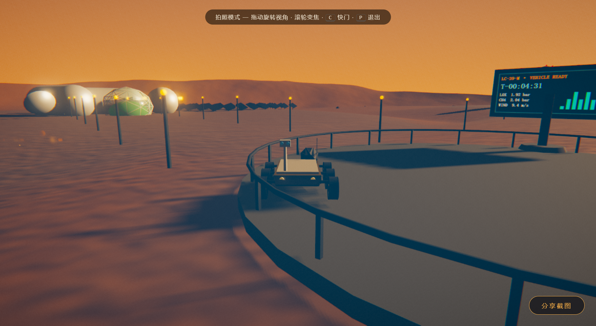
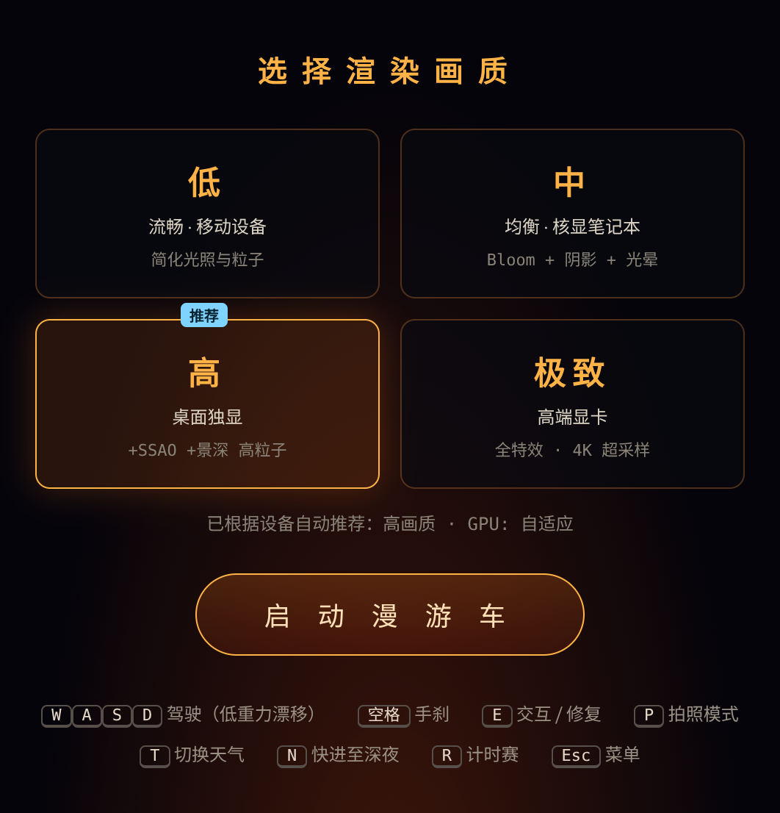
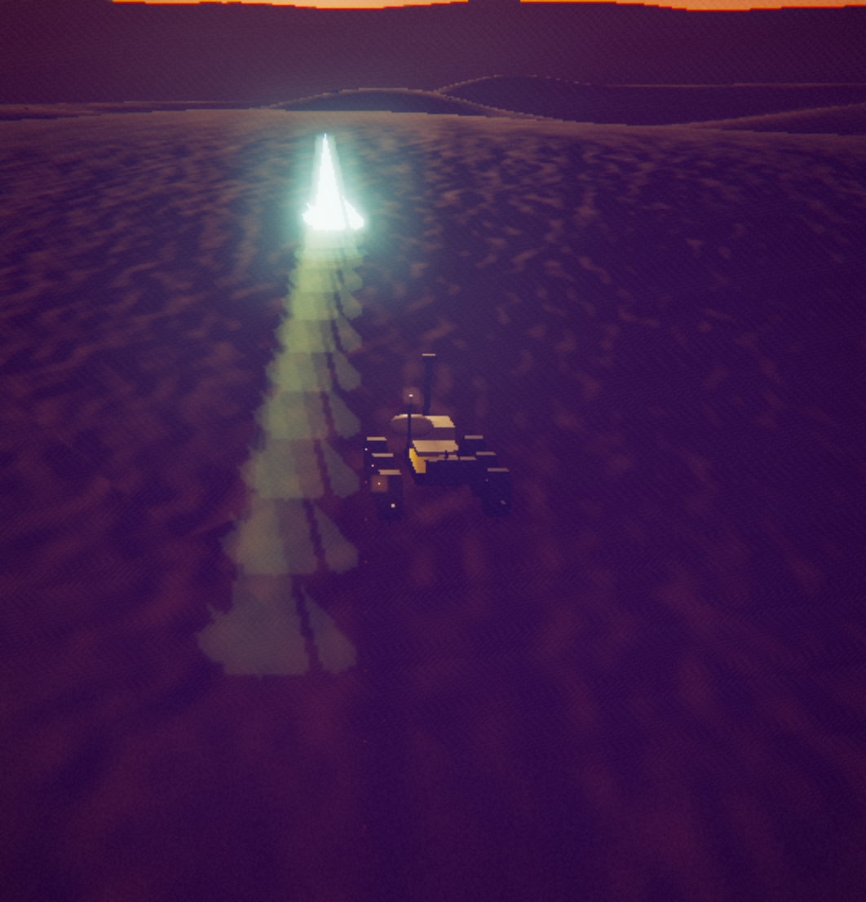
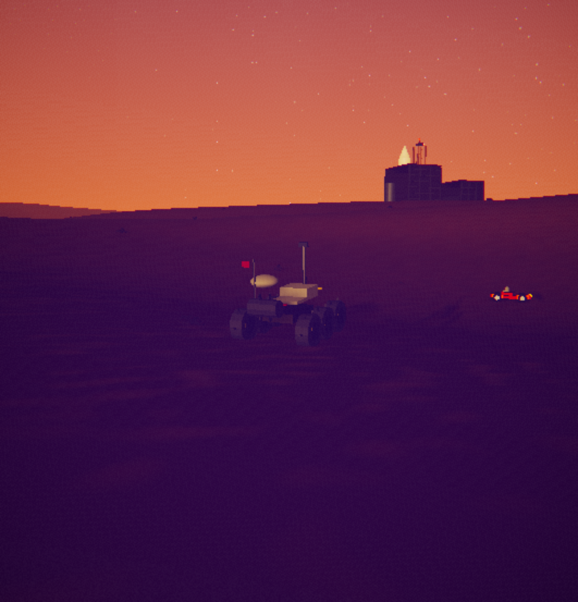
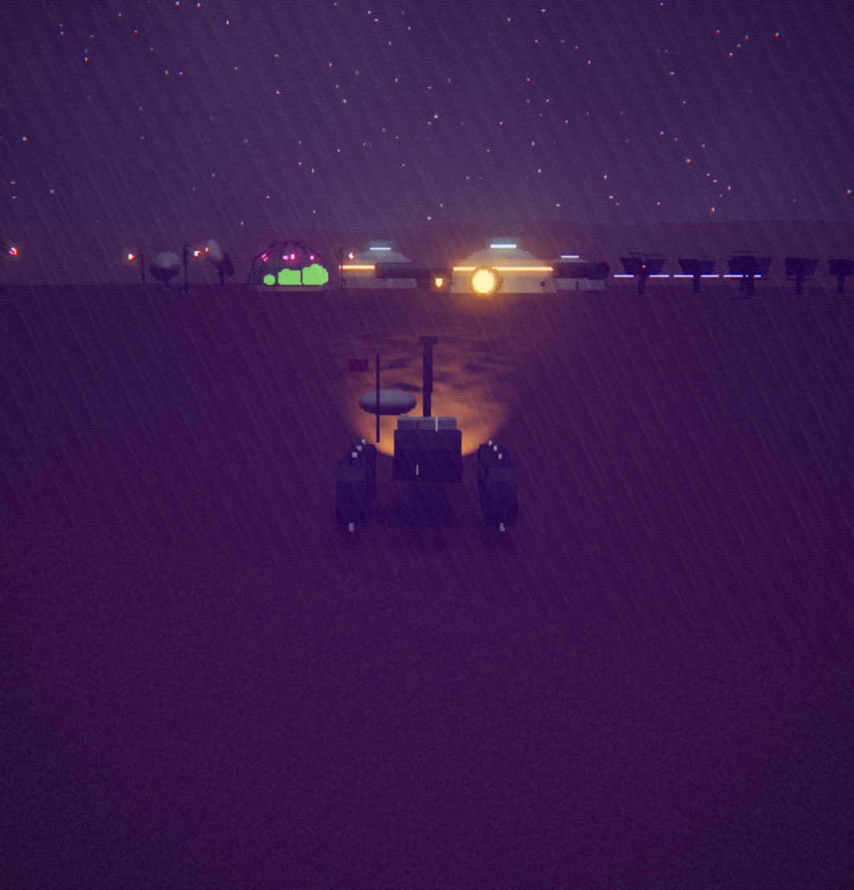
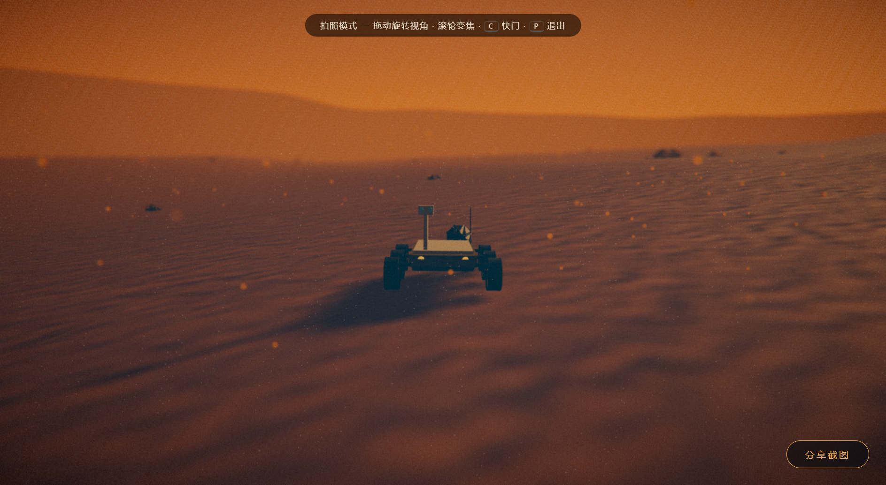
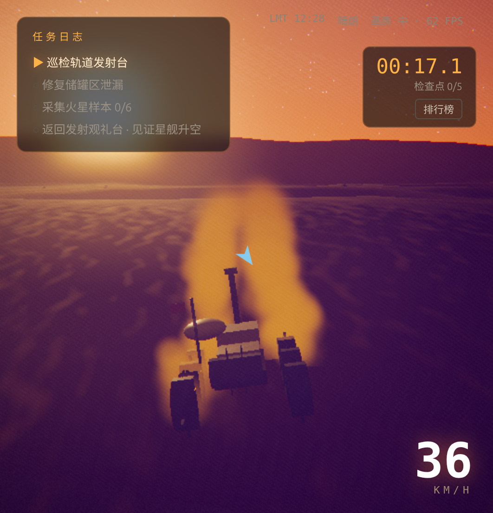

# RED STARBASE · 火星车星舰基地交互艺术体验

> 一个纯浏览器运行的 3D 交互艺术体验：驾驶六轮火星漫游车穿越「火星版 Starbase」，
> 在电影级实时渲染中完成巡检、抢修、采样任务，最后在观礼台见证星舰升空。

**Blender 建模 + 程序化环境**——基地地标（生活穹顶、温室、发射塔、星舰、漫游车、储罐、太阳能阵、通信碟、路灯、外星晶体、着陆器残骸、计时赛拱门）
全部用 `tools/blender/build_assets.py` 以 Blender Python 无头建模、导出为 `public/assets/*.glb`（共 13 个风格化资产，约 550 kB），
运行时用 `GLTFLoader` 载入；地形、天空、材质、粒子、音效仍 100% 程序化生成。
three.js 本体已 vendor 到 `vendor/three/`，仓库自带 import map，**没有 npm 也能直接跑**。



---

## 快速开始

### 方式 A · 零依赖直跑（推荐，无需 npm / node_modules）

```bash
python3 tools/serve.py 5173      # 起一个静态服务器，仓库根为站点根，public/ 挂到 /
# 浏览器打开 http://localhost:5173
```

`index.html` 里的 import map 把 `three` 指向 `vendor/three/build/three.module.js`，
`three/addons/` 指向 `vendor/three/examples/jsm/`，浏览器原生 ES Module 直接解析，无需打包。

### 方式 B · Vite（有 npm 环境时）

```bash
npm install
npm run dev        # http://localhost:5173
npm run build      # 产物在 dist/
npm run preview    # 本地起一个静态服务器验证构建产物
```

### 重建 3D 资产（改模型后）

```bash
npm run assets     # = blender --background --python tools/blender/build_assets.py
```

脚本会重新生成 `public/assets/` 下全部 `.glb`。想调造型就改脚本里对应的 `build_*()` 函数
（每个地标一个函数，参数是米制、Z-up，导出时转成 three.js 的 Y-up）。

`vite.config.js` 里 `base: './'`，所以 `dist/` 是**可移植的**：直接丢到 Vercel / Netlify / GitHub Pages / 任意静态托管都能跑
（注意别用 `file://` 双击打开，ES Module 会被 CORS 拦）。

想直达某个演示，加查询参数：`?auto=low|med|high|ultra`、`?demo=warp|launch|storm|night`。

> 线上演示：https://red-starbase-wgmag3xoh66.qoder.website/ （公开可访问，无需登录；实测 58–64 FPS、零控制台错误）。

---

## 操作

### 桌面

| 按键 | 作用 |
| --- | --- |
| `W` / `↑` | 加速 |
| `S` / `↓` | 刹车 / 倒车 |
| `A` `D` / `←` `→` | 转向 |
| `空格` | 手刹 —— 低重力侧向漂移 |
| `E` | 交互：查看信息卡、长按修复储罐泄漏、夜间触发灯光秀 |
| `P` | 拍照模式：隐藏 HUD，拖拽环视、滚轮推拉，可截图 / 系统分享 |
| `T` | 切换沙尘暴 |
| `N` | 时间快进至深夜（银河 + 星舰灯光秀） |
| `R` | 开始 / 退出环基地计时赛，成绩写入本地排行榜 |
| `Esc` | 返回菜单 |

### 移动端

左下摇杆转向，右下 `油门 / 刹车 / 漂移 / 交互` 四键（`交互` 即触屏版 `E`，长按 3 秒完成储罐修复，否则任务线会在手机上卡死）。
横屏高度不足时四键自动排成 2×2，速度表移到右上角避免与按键重叠。画质自动降级为 `低`，并在 HUD 弹出降级提示。

## 画质档位

| 档位 | 分辨率倍率 | 阴影 | SSAO | 景深 | Bloom | 体积光 | 粒子 | 环境反射刷新 |
| --- | --- | --- | --- | --- | --- | --- | --- | --- |
| 低 | 0.75 | — | — | — | 0.55 | — | 30% | 1 Hz |
| 中 | 1.0 | 1536 | — | — | 0.70 | ✓ | 60% | 2 Hz |
| 高 | 1.5 | 2048 | ✓ | ✓ | 0.85 | ✓ | 100% | 4 Hz |
| 极致 | 2.0 | 4096 | ✓ | ✓ | 0.95 | ✓ | 160% | 6 Hz |

- 启动时按 `navigator.hardwareConcurrency`、`deviceMemory`、UA 与 WebGL renderer 字符串自动推荐档位。
- 运行中若平均帧率持续低于目标，逐级自动降档并在 HUD 提示。



---

## 体验结构

**任务线**：巡检轨道发射台 → 修复储罐区泄漏（长按 `E`）→ 收集 6 块火星样本 → 返回发射观礼台见证升空。
集齐样本本身就是奖励的开关——发射窗口随之开启。

**七大区域**（`src/config.js` 的 `ZONES`），各有独立视觉主题：

| 区域 | 元素 | 主题 |
| --- | --- | --- |
| 发射区 | 轨道发射台、Mechazilla 夹臂、星舰 + 超重型助推器 | 工业宏大、倒计时紧张 |
| 生产区 | High Bay / Mid Bay / 星舰原型机、焊接火花 | 橙红火花、机械节奏 |
| 储罐区 | 液氧甲烷球罐与管廊 | 冷色调、科技感 |
| 生活区 | 火星基地舱段 + 太阳能阵列 | 暖色、平静 |
| 野外 | 沙丘、陨石坑、岩石、火星样本 | 孤独、星空、渺小感 |
| 沙尘暴区 | 体积雾、沙尘粒子、屏幕脏污 | 压抑、声音沉闷 |
| 夜空观赏点 | 银河、星舰灯光、实时环境反射 | 冷峻、希望 |

**动态大气**：昼夜循环（300 秒一天），晴 / 沙尘暴 / 黄昏 / 深夜四种视觉与听觉状态，太阳方位驱动天空 shader、雾色、阴影与 god ray。



**彩蛋**：野外坐标 `(470, 420)` 附近停着一辆 Tesla Roadster；夜间靠近星舰按 `E` 触发灯光秀。






> 关于配图：这些帧全部来自真实浏览器实拍（`python3 tools/serve.py` 直跑仓库根，或 `npm run dev`），用的是体验自带的拍照模式（`P` 键，隐藏 HUD、可拖拽环视）。
> 也就是说画面里看不到任务日志与帧率条，不是后期擦掉的，是体验本身的一种状态。

---

## 技术要点

**栈**：Three.js 0.169（WebGL2，vendor 于 `vendor/three/`）。无框架、无贴图/音频文件、无运行时第三方依赖；
全部 3D 资产为 Blender 脚本自产的 13 个 `.glb`（约 550 kB），随仓库分发。

```
src/
  config.js          世界布局、画质档位、任务常量
  main.js            状态机：加载 → 菜单 → 驾驶 → 任务/事件 → 发射
  input.js           键盘 + 触屏摇杆
  ui.js              HUD、信息卡、倒计时、排行榜、拍照面板
  world/             地表网格与地形、天球 shader、太阳/天气/环境反射、七大区域设施几何
  vehicle/           低重力车辆物理（惯性、坡度贴合、手刹侧滑、碰撞推离、落地 trauma）、六轮漫游车
  camera/chase.js    弹性跟随相机：速度拉伸 FOV、地形抬升、trauma 抖动、双段发射机位
  fx/                后处理链（SSAO → DOF → UnrealBloom → 自定义 FINAL → OutputPass）、CPU 粒子池
  audio/audio.js     WebAudio 空间化：引擎/风/无线电/泄漏嘶声/发射轰鸣，风暴低通滤波
tools/               无头验证脚本（CDP），见 docs/VERIFICATION.md
```

- **后处理 FINAL pass**（`src/fx/post.js`）在 HDR 缓冲上做：径向色散、朝太阳 UV 的 10 步 god ray 行进、
  琥珀高光 / 青色阴影分离调色、压黑 + 提饱和、沙尘屏幕脏污与尘点、暗角、发射闪光色偏、胶片颗粒；ACES 由 `OutputPass` 收尾。
- **地形与物理同源**：`surfaceAt(x, z)` 在 250×250 段网格上做精确三角插值，地形网格、车辆物理、相机、碰撞体、
  传送、计时门全部读它——所以不会出现「视觉上在地面、物理上在地下」。
- **星舰不锈钢反射**：`CubeCamera` 按档位以 1–6 Hz 节流刷新，实时把火星天空与地形烘进金属度贴图。
- **性能策略**：InstancedMesh 岩石与合并几何、按档位的粒子与 MSAA 预算、节流的环境反射、逐物体视锥剔除。
- **加载与首屏**：加载动画的 DOM 直接写在 `index.html`，入口 JS 是 `type="module"`（defer），
  所以动画在任何游戏 JS 执行前就已经画出来了。

完整的设计取舍、踩坑记录与全部实测数字在 **[docs/VERIFICATION.md](docs/VERIFICATION.md)**。

---

## 验证方式（不靠肉眼）

`tools/` 里是一套 CDP 无头脚本，用真实按键事件驱动页面、逐步断言并抓帧，跑的是**构建产物**而不是 dev server：

> 注：下表为 Blender 资产改造**之前**的整链审计结果。改造后已在真实浏览器中复验：60 FPS、控制台零报错、
> 驾驶/转向/轮子枢轴、发射序列、灯光秀、风暴与夜间状态均正常。CDP 脚本待接入 `.glb` 加载后重跑。

| 项目 | 结果 |
| --- | --- |
| 完整交互链审计（巡检 → 修漏 → 采样 → 集齐奖励 → 彩蛋 ×2 → 拍照 → 分享 → 计时赛 → 排行榜 → 风暴音频 → 发射链） | 退出码 0，**0 条未捕获异常** |
| 连续驾驶 soak（13 段一镜到底，327 秒 / 859 次采样） | **0 次穿模、0 次姿态越限、0 次异常**，脚本判定 `SOAK VERDICT PASS` |
| 冷启动可交互 | `bootMs` 1.0–10 s（软渲染下的几何构建耗时，非下载） |
| 移动端 | 自动降为 `low`，触屏四键可完整走完任务链 |

> 诚实说明：整链审计跑在 CPU 软渲染（SwiftShader）上，那部分数字只能证明画面、交互与音频链路正确。
> 另外在**真实 GPU**（AMD Radeon 610M 核显，1887×1034）上补测过一次：`高` 档 HUD 实测 22–27 FPS，
> 并触发了自动降档提示——**降级链路本身在真机上是有效的**；但「桌面独显 60 FPS」这一条本机没有条件验证。

---

## 已知边界

1. **桌面独显 60 FPS 未验证**——本机只有 AMD Radeon 610M 核显：`高` 档实测 22–27 FPS 并触发自动降档（降级链路可用），
   但「高端设备 60 FPS」需要你在本地跑 `npm run dev` 后用右上角状态条自查。
2. **线上部署已执行**——`dist/`（`npm run build` 产物）已发布为公开站点（见上方线上演示链接）；后续改动源码后需重新 `npm run build` 并发布新版本。
3. **KTX2 / DRACO 不适用**——零贴图；Blender 资产为未压缩 `.glb`，总量约 550 kB，引入压缩的收益小于复杂度；**Web Worker 未使用**——地形与设施几何在加载阶段一次性构建，运行期靠 InstancedMesh、按档位预算与视锥剔除，没有多级 LOD 网格。
4. **WebGPU 路径未实现**——当前为 WebGL2，优先保证可部署与可降级。

---

## 参考与借鉴

| 来源 | 借鉴 | 明确不借鉴 |
| --- | --- | --- |
| [bruno-simon.com](https://bruno-simon.com/) | 驾驶探索框架、车辆物理、加载与社区感、计时排行 | 低多边形卡通美术 |
| [wind-waker-threejs.com](https://wind-waker-threejs.com/) | 画质/模式选择、收集物、截图分享的体验组织方式 | 塞尔达题材与着色风格 |
| [threejs.org/examples](https://threejs.org/examples) | `webgl_postprocessing_unreal_bloom`、GPGPU 粒子、程序化地形/海洋、车辆控制器示例的模块划分 | 只做技术 demo、无叙事 |
| 《星际拓荒 Outer Wilds》 | 永恒黄昏的紫橙天空、紫色阴影 + 琥珀高光分级、孤零零基地灯火的叙事感 | 太空题材与关卡结构 |

美术方向：**《星际拓荒》的永恒黄昏**——紫罗兰天顶熔进橘粉地平线，暮色里基地的暖窗与霓虹灯带逐一点亮，
叠加《银翼杀手 2049》的橙红雾霾与《星际穿越》的冷峻工业感，目标是每一帧都值得截图。

## 资源调研记录（先找资源，避免重复建设）

改造前对可复用资源做了调研，结论与取舍：

| 渠道 | 内容 | 决策 |
| --- | --- | --- |
| [three.js 官方仓库](https://github.com/mrdoob/three.js)（npm `three@0.169.0`） | 渲染器 + GLTFLoader + 全套 postprocessing | ✅ 直接 vendor 进 `vendor/three/`（按依赖闭包裁剪），不自己造轮子 |
| [Sketchfab 低模火星基地/空间站](https://sketchfab.com/3d-models/mars-science-station-low-poly-808afc037a254494a040d409b0bf3d70)（[Mars Science Station](https://sketchfab.com/3d-models/mars-science-station-low-poly-808afc037a254494a040d409b0bf3d70)、[Low Poly Space Kit](https://sketchfab.com/3d-models/low-poly-space-kit-7045c47936934d6988a15cb7ce4eb20b)、[Low poly space station](https://sketchfab.com/3d-models/low-poly-space-station-717e672923484b0b9c66d6df19b211fc)、[Sci-Fi Space Station](https://sketchfab.com/3d-models/sci-fi-space-station-f6b9106fffc64fec93cabc17492cb2e4)） | 造型语言参考（穹顶/桁架塔/储罐布局） | ⚠️ 只读作美术参考：授权参差、贴图重、风格不统一，不直接下载进仓库 |
| [BlendSwap 空间站模型](https://blendswap.com/3d/space-station) / [CGTrader low-poly space](https://www.cgtrader.com/low-poly-3d-models/space) | 免费 .blend 源 | ⚠️ 同上，多角灯、材质混乱，导入后返工成本高于自产 |
| Blender 5.2 LTS（本机 `/snap/bin/blender`） | Python API 无头建模 + glTF 导出 | ✅ 最终路线：`tools/blender/build_assets.py` 一个脚本产出全部 13 个 `.glb`，可版本化、可复现、零外部依赖 |

**为什么自产而不下载**：项目要进 three.js showcase，风格一致性是硬要求；
脚本化建模让「改一个参数 → 全基地重出」只需 40 秒，比修第三方模型干净得多。

## Blender 资产清单（`public/assets/`）

| 资产 | 用途 | 关键节点（运行时驱动） |
| --- | --- | --- |
| `rover.glb` | 玩家漫游车 | `wheelpivot_0..5`（转向/滚动枢轴） |
| `starship.glb` | 发射台主角 | 材质克隆后接入灯光秀 `lightStrips` |
| `launch_tower.glb` | Mechazilla 桁架塔 | 整体静态 |
| `habitat_dome.glb` | 生活穹顶 ×4 | 琥珀窗带自发光 |
| `greenhouse.glb` | 玻璃温室 | 品红植物生长灯 |
| `cryo_tank.glb` | 推进剂储罐 ×8 | 非均匀缩放适配不同罐径 |
| `solar_array.glb` | 太阳能阵 ×15 | 静态 |
| `comm_dish.glb` | 通信碟 ×3 | 静态 |
| `lamp.glb` | 道路灯 ×60 | 静态 |
| `crystal.glb` | 矿物样本 ×6 | 整组旋转悬浮 |
| `lander.glb` | 沙尘暴区残骸 | 侧翻姿态 |
| `gate.glb` / `rock_cluster.glb` | 预留：计时赛门 / 岩石散布 | — |


